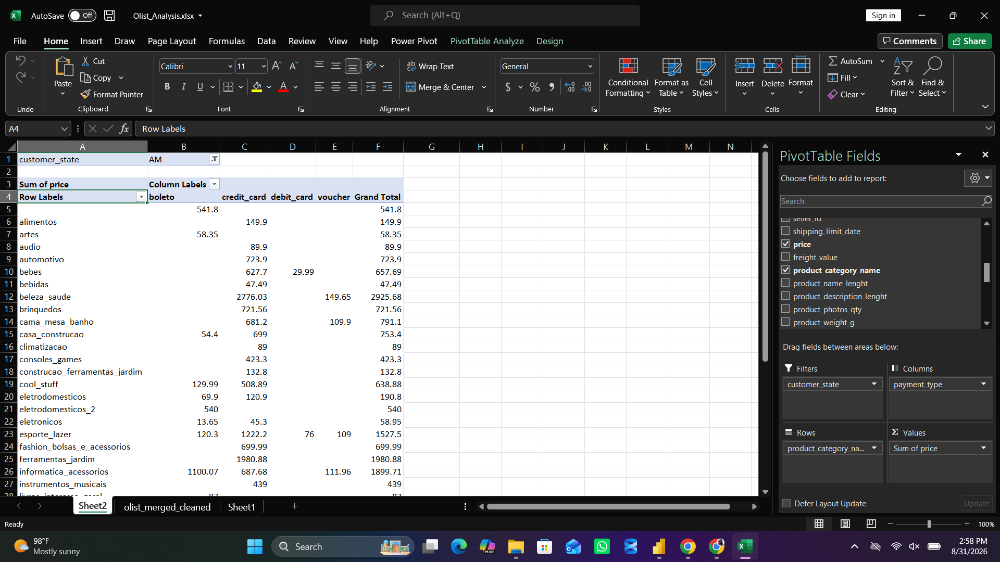

# Olist E-commerce Analytics — End-to-End Data Project

An end-to-end data analytics project on the Olist Brazilian E-commerce 
dataset — from raw data cleaning to interactive dashboarding. The 
pipeline covers Python for cleaning, SQL for analysis, Excel for 
exploratory pivoting, and Power BI for the final interactive report.

## Project Pipeline

### 1. Python — Data Cleaning & Preparation
- Merged 6 raw CSV files (orders, customers, order items, products, 
  payments, reviews) into a single dataset using `pandas`
- Handled missing values (dropped rows with missing review scores, 
  product IDs, or price)
- Converted date columns to proper datetime format
- Engineered a new feature: `delivery_delay_days` (actual vs. 
  estimated delivery date)
- Found that late deliveries correlate with lower average review 
  scores compared to on-time/early deliveries
- Exported the cleaned dataset (`olist_merged_cleaned.csv`) for SQL 
  and Power BI use

File: [`python/data_cleaning_eda.py`](python/data_cleaning_eda.py)

### 2. SQL — Business Analysis
Queried the cleaned dataset to answer key business questions:
- Revenue and order count by product category
- Total revenue by Brazilian state
- "Premium & loved" categories — above-average order value AND 
  above-average review score
- Top-ranked seller by revenue in each state (using `RANK() OVER 
  PARTITION BY`)
- Monthly revenue trend
- Relationship between payment installment count and review score
- **RFM customer segmentation**: built a `customer_rfm_base` table 
  and a `vw_customer_rfm` view, scoring each customer on Recency, 
  Frequency, and Monetary value using `NTILE(4)` window functions

File: [`queries.sql`](queries.sql)

### 3. Excel — Exploratory Pivot Analysis
Used PivotTables to explore revenue by product category, segmented 
by payment type and filtered by customer state.

### 4. Power BI — Interactive Dashboard
Built a 3-page interactive report on top of the SQL RFM view:

- **Business Overview**: Total revenue, order count, average review 
  score, and monthly revenue trend
- **Category Analysis**: Revenue and order volume by product 
  category, and payment type breakdown
- **Customer Segments**: RFM-based segmentation (VIP, Loyal, At 
  Risk, Churned) with a calculated DAX column, donut chart, and 
  customer-level detail table

File: [`powerbi_dashboard.pdf`](powerbi_dashboard.pdf) (exported 
report — source `.pbix` file available on request due to file size)

## Key Insights
- **$14.14M** total revenue across **97,917 orders**
- Average review score: **4.03 / 5.0**
- **Beleza & Saúde (Beauty & Health)** leads in revenue
- **Automotivo** has the highest order volume (3,877 orders)
- **Credit card** dominates payments at **77.25%** of transactions
- RFM segmentation of 94,721 customers: **49.36% Loyal**, **46.51% 
  At Risk**, **2.89% VIP**, **2.74% Churned** — highlighting a 
  significant retention opportunity in the At Risk segment
- Delivery delays are associated with measurably lower review scores

## Tools Used
`Python (pandas)` · `SQL (T-SQL)` · `Excel (PivotTables)` · 
`Power BI (DAX, Power Query)`

## Dataset
[Olist Brazilian E-commerce Public Dataset](https://www.kaggle.com/datasets/olistbr/brazilian-ecommerce) 
(Kaggle)

## Author
**Tayyab Ali**  
GitHub: [@Tayyabali-analyst](https://github.com/Tayyabali-analyst)  
LinkedIn: [https://www.linkedin.com/in/tayyab-ali-analyst/]
